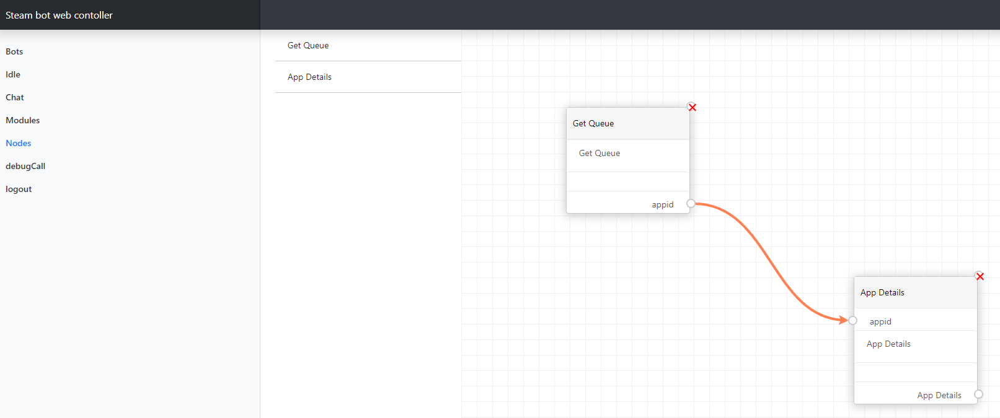

# Info
you can now build a module via node. it is simple and have a web interface. whit a drag and drop panel. 

you can easy made new node for the builder, look in the ´nodeStandardModules´, folder. where each file can have a list of nodes. then when loading the system, it can be used in the node builder. 

right now the it preload standard module. but the save and loade funcion have been made, but right now it do not save it.
so it is lost. 

THIS IS STILL UNDER DEVELOPMENT.

## Save
To save run code 
```js
console.log("save");
var boxesStored = [];
var boxConnectionsStored = [];
allboxs.forEach(box => {
    boxesStored.push(box.ExportBox());
    boxConnectionsStored = boxConnectionsStored.concat(box.ExportConnections());
});
console.log(JSON.stringify({boxes: boxesStored, connection: boxConnectionsStored}));
```
## Load
To load a saved node build, it have to pase a obj into the methode load. 
Like: 
```js
Load(JSON.parse('{"boxes":[{"UniqId":"testxx","RealId":1,"x":"686px","y":"344px","fields":[]},{"UniqId":"testx","RealId":4,"x":"314px","y":"173px","fields":[]}],"connection":[{"FromID":"testx_O_0","FromRealId":4,"ToID":"testxx_I_0","ToRealId":1}]}'));
```
# Preview
